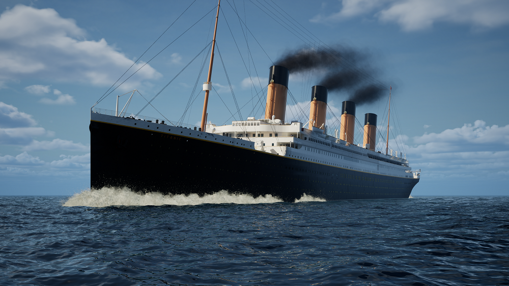

# Ejercicio sobre los datos del Titanic

Este repositorio se basa en un ejercicio libre para medir nuestros conocimientos adquiridos en el primer módulo del Bootcamp de Upgrade Hub. El conjunto de datos sobre el que estamos trabajando es el de Titanic.

## Conjunto de datos

Este dataset consta de 12 columnas principales, de las cuales algunas estarán dañadas y podrán ser reparadas y otras deberáan ser eliminadas. También veremos como alguna columna es añadida para visualizar mejor algun dato que otro y exponerlo mediante nuevas gráficas. Dentro de dichas columnas, contamos con 891 datos individualies, que agruparemos y expondremos graficamente los más interesantes.

## Objetivos

El principal objetivo no es otro que aprender y seguir cogiendo experiencia en este mundillo. Practicar con el código, ver nuevas gráficas y empezar a pensar más de vez en cuando como un analísta de datos. Dentro de este objetivo se desprenden otros más en relación con el conjunto de datos con el que trabajamos. Lo más interesante sería ver si existe alguna variable que nos indique si había alguna manera en la que aumentara las probabilidades de sobrevivir al accidente cambiando alguna de estas variables antes de zarpar con el barco. Descifrar algún patrón de supervivencia de cara a futuros viajes como estrategias de marketing estaría dentro de otro de los objetivos. Para ser más concretos, la lista completa se desprende así:

- ¿Cuantas personas han sobrevivido?
- ¿Había más mujeres o más hombres?
- ¿Cual es el % de mujeres que sobrevivieron, y de hombres?
- ¿Cuales fueron las personas con mayor y menor edad en subir al barco?¿Y la edad media?
- ¿Cual es la tasa de supervivencia por edades?
- ¿Cual es la distribución de edades por clase?
- ¿Qué relación hay entre la clase del pasajero y si sobrevivieron o no?
- ¿Y entre la edad y el genero con si sobrevivieron o no?
- ¿Cual es la tasa de superviviencia si se va en familia?
- ¿Cuales fueron los 10 billetes más caros?¿Quién los ha comprado?
- ¿Qué relación hay entre el precio y el puerto de embarcadero?
- ¿Cual fue el puerto de embarque donde sobrevivieron más personas?
- ¿Existe relación hay entre el embarcadero y lo que costó el billete con si sobrevivieron o no? ¿Y con el género?

## Resultados

Como resultado general, vemos que efectivamente, como nos proponíamos en los objetivos del proyecto, sí hay variables que influian directamente en la supervivencia, como son, la clase en la que se viajaba, el puerto donde se embarcaba, el precio del billete, la edad del pasajero e incluso el género. Unos resultados algo esperados ya que fue una tragedia bastante mediatica y a su vez hace ya más de 100 años desde que ocurrió, por lo que la información tanto escrita como cinematográfica que tenemos es amplia, pero asimismo, soprende el ver las cifras reales y ponerte en la situación de esas personas que por elegir una clase en la que viajar por ejemplo o el puerto donde embarcar, sus posibilidades de sobrevivir se duplicaban practicamente.
Dentro del código tenemos el ejemplo de todo esto visualmente expuesto para una mejor visualización de los datos.

## Código

Para ejecutar el código, primero, antes de todo, asegúrese de tener todas las dependencias instaladas.

## Contribuciones

Las contribuciones a este repositorio son bienvenidas. Asegúrese de que el código siga las mejores prácticas y esté bien documentado.

## Licencia

Este proyecto está bajo la licencia MIT.

